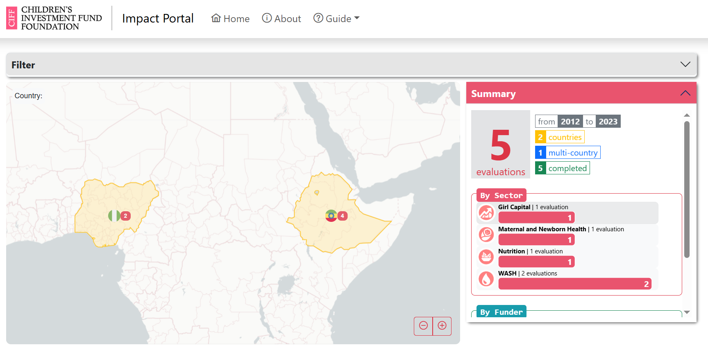
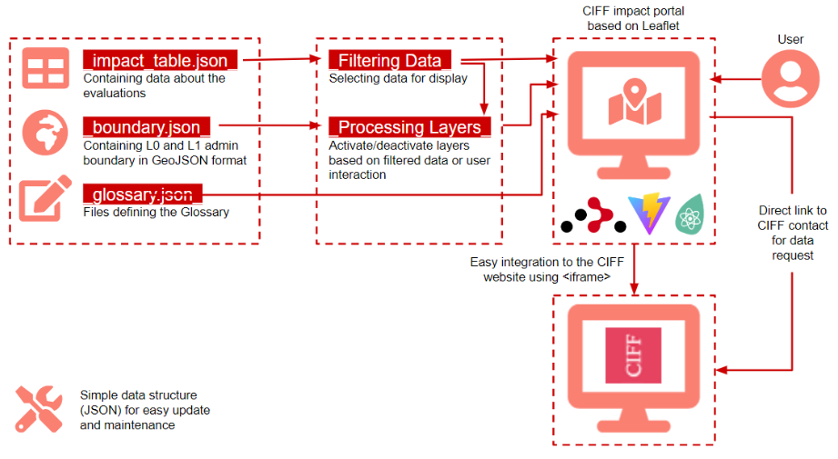
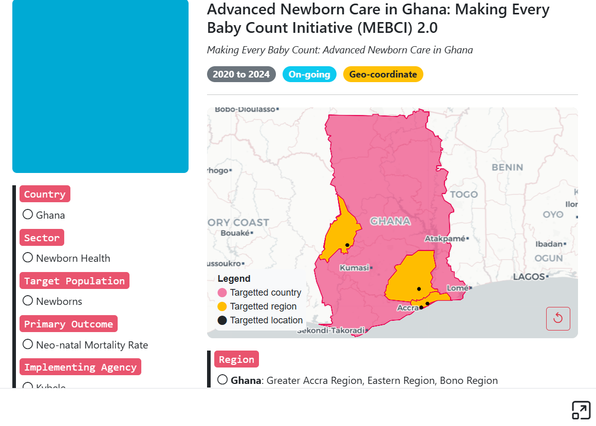

# Impact Evaluation Portal



---

To support impact evaluation performed by [Children Investment Fund Foundation (CIFF)](https://ciff.org), we developed a web application portal that includes an interactive map and data filtering. The portal acts as a showcase of investments/evaluations by CIFF happening in several countries around the Globe. It displays evaluations at both country- and subnational-level. Following the richness of information related to the listed investments/evaluations, dynamic overlays of the data on the map is implemented so that those information can be grasped easily.

| App Name | CIFF Impact Evaluation Portal |
| --- | --- |
| Customer | CIFF (Children Investment Fund Foundation) |
| Project lead | Carla Pezzulo |
| Development Team | Rhorom Priyatikanto, Maksym Bondarenko |
| Repository | https://rhorom.github.com/ciff_impact_portal |
| Web URL | https://rhorom.github.io/ciff_impact_portal |
| | https://impact.ciff.org |

## About this file
The purpose of this file is to provide overview, background information, and setup information of the project. If you have joined this project as a part of the development team, please ensure this file is up to date.

Note : Any dependencies added/modified to this project which affect the running of the code in this git repository must be listed in this file. All developers must ensure that the instructions mentioned in this file are sufficient to enable a new developer to obtain a executable copy of the latest code in this repository, without involvement from any other human assistance.

## Table of contents
- [Features](#features)
- [Dependencies](#dependencies)
- [Architecture](#architecture)
- [Source files](#source-files)
    - [Directory tree](#directory-tree)
    - [File description](#file-description)
- [Data structure and update](#data-structure-and-update)
    - [Boundary file](#boundary-file-srcdataboundaryjson)
    - [Impact table](#impact-table-srcdataimpact_tablejson)
- [Content update](#content-update)
    - [Pages](#pages)
    - [Images](#images)
- [Development setup](#development-setup)
- [Deployment setup](#deployment-setup)

## Features
Several functionalities are activated to ensure interactivity, informativeness, and efficacy of the portal. Firstly, the main functionality is intuitive filters to narrow down displayed evaluations based on various criteria (country, sector, target population, primary outcome, and evaluation status). Secondly, listing programmes associated with a selected country. Form-based filtering is linked to the map so that country selection can be performed through clicking a particular country on the map or selection through form. In case of multi-country investment/evaluation, all countries relevant to the programme can be displayed on the map. Lastly, more extensive information (programme description, implementation years, results, etc.) for a particular programme can also be showcased in a neat format.

Responsive, reactive, and user friendly are three main characteristics of the aimed portal. Thus, we developed the portal using [React-Vite](https://vite.dev) as the framework. This framework was integrated with [React-Router](https://reactrouter.com) to enable deep linking and routing of the portal. User's experience and history are recorded in a structured URL so that sharing and tracking can be done. Responsive layout and components were constructed using [React-Bootstrap](https://react-bootstrap.netlify.app) with some additional customization based on the CIFF's brand sheet. Utilizing this library, the portal adapts flawlessly into different screen sizes, from smartphones to desktops. [React-Leaflet](https://react-leaflet.js.org) becomes the backbone for interactive mapping of the data, supported by several publicly available basemaps. The high-level architecture of the portal and technical documentation associated can be found in the [Architecture](#architecture) section. In terms of user friendliness, guidance and notes are provided on the portal. General description about the portal, its standard operating procedures, and even a glossary of terms and abbreviations are easily accessible from the header menu. 

Considering the needs of periodic updates on the overlaying data, we use JSON data structures to encapsulate both tabular data associated with the CIFF investments/evaluations and the geographic data defining administrative boundaries and points of interest.

## Dependencies
This portal mainly depends on the following javascript libraries:
- [React 18.2.0](https://react.dev) for reactive application development
- [React-router 6.21.0](https://reactrouter.com) for routing and deep-linking feature
- [React-leaflet 4.2.1](https//react-leaflet.js.org) for interactive mapping in react
- [React-bootstrap 2.9.1](https://react-bootstrap.netlify.com) for responsive layout and styling
- [Primeicons 6.0.1](https://primeng.org) as icons library
- [Html-react-parser 5.0.11](https://www.npmjs.com/package/html-react-parser) for parsing text with HTML-format
- [React-circle-flags 0.0.23](https://www.npmjs.com/package/react-circle-flags) for visualisation

## Architecture
CIFF Impact Evaluation Portal aims to display and map the investments by CIFF all over the world and the associated impacts. Users can interact with the portal by filtering the data and selecting the country of interest where CIFF investments and evaluations exist. This portal is based on React. It has a responsive design that enables users to access the portal using various devices. Seamless integration of the portal to the main CIFF website became a major consideration in the portal design and development. It uses the standard CIFF color scheme as in the main CIFF website. Its architecture and data structure are relatively simple so that further update and development of the portal will not be head scratching.



## Source files
### Directory tree
```
ciff_impact_portal
|-- dist
|-- public
|-- src
|   |-- data
|   |   |-- boundary.json
|   |   |-- glossary.json
|   |   |-- impact_table.json
|   |-- App.jsx
|   |-- config.jsx
|   |-- Evaluation.jsx
|   |-- Graphic.jsx
|   |-- index.css
|   |-- main.jsx
|   |-- MainApp.jsx
|   |-- Map.jsx
|   |-- MapSmall.jsx
|   |-- Pages.jsx
|   |-- PanelFilter.jsx
|   |-- PanelInfo.jsx
|   |-- utils.jsx
|-- index.html
|-- package.json
|-- README.md
```

### File description
| File name | Description |
| --- | --- |
| `dist/` | Default folder for the optimized scripts and files to deploy. Command `vite build` will do the optimisation and fill this folder with the resulting files. |
| `public/` | Directory for images used in the portal. |
| `index.html` | The main HTML file for the portal. It calls all required JavaScript libraries and CSS stylesheets. The main script (src/main.jsx) is sourced by this main file. |
| `package.json` | Basic information about the app, its dependencies, and script aliases to build, test, and deploy the app. App name, version, and homepage are defined in this file. |
| `vite.config.js` | Configuration and settings for Vite are stored in this file. Normally, we do not need to change anything in this file. |
| `src/config.jsx` | Containing some variables to configure the app. |
| `src/index.css` | The CSS file for rendering the app. |
| `src/main.jsx` | The main javascript which renders all react components associated with the app. |
| `src/App.jsx` | All react components used in the portal are defined and returned in this file. |
| `src/MainApp.jsx` | This file defines the main part of the map, which are filter panel, map panel, and info panel on the right. |
| `src/Evaluation.jsx` | Defining the information related to a specific evaluation. |
| `src/Graphic.jsx` | Visual summary of the listed evaluations is governed by this source file. |
| `src/Map.jsx` | This javascript dictates how the map is displayed and how it interactively behaves. |
| `src/MapSmall.jsx` | Defining evaluation-specific map that is called in `Evaluation.jsx` and `PanelInfo.jsx`. |
| `src/Pages.jsx` | Contents displayed in the 'modal' when the user clicks 'About', and 'Guide' menu on top of the page. |
| `src/PanelFilter.jsx` | Defining the filtering functionality of the app. |
| `src/PanelInfo.jsx` |  |
| `src/utils.jsx` | Containing basic functions required in the app. |

## Data structure and update
There are two main data files to be sourced by the portal. Both are stored as JSON and can be easily updated.

### Boundary file (`src/data/boundary.json`)

Geographical data defining the administrative boundary of countries (L0) and regions (L1) relevant to the CIFF impact evaluation is stored in [GeoJSON format](https://geojson.org) with specifically defined columns. This is a standard and widely-used format so that update and extension will not be difficult. Prior knowledge on this data format will be useful for further update and development.

`boundary.json` contains geo-coordinates of the administrative boundary of the countries (L0) and regions (L1) which are accessible through the portal. `Country`, `CountryID`, `Region`, and `RegionID` are keys/columns that need to be synchronized with `impact_table.json`. `CountryID` is basically similar to `Country`, but with whitespace removed. The same applies to `RegionID`. Level should identify the administrative level, either `ADM_0` or `ADM_1`. `Lon` and `Lat` specifies the centroid of the boundary over which marker will be placed. geometry defines the boundary itself. It may contain `POLYGON` or `MULTIPOLYGON` objects.

In case more countries or regions are added to the list of evaluations, `boundary.json` needs to be extended accordingly. Most of the boundaries listed in the portal were sourced from [Geoboundaries](https://geoboundaries.org) or other sources. Boundary data in GeoJSON format can be downloaded from this site. If a different source is preferred and a different format (e.g., shapefile) is provided, then the boundary data needs to be converted into GeoJSON format prior to the addition to the `boundary.json`. For this purpose, an online converter will absolutely be useful. The acquired boundary data needs to be harmonized such that the properties or columns are similar to that of `boundary.json`.

```json
{
    "type": "FeatureCollection",
    "crs": { 
        "type": "name", 
        "properties": { 
            "name": "urn:ogc:def:crs:OGC:1.3:CRS84" } 
            },
    "features": [
    { 
        "type": "Feature", 
        "properties": { 
            "FID": 1, 
            "Country": "Bangladesh", 
            "CountryID": "Bangladesh", 
            "CountryISO": "bd", 
            "Region": " ", 
            "RegionID": " ", 
            "Level": "ADM_0", 
            "Lon": 89.889, 
            "Lat": 23.674 
            }, 
        "geometry": { 
            "type": "MultiPolygon", 
            "coordinates": [ [ [ 
                [ 92.314, 20.666 ], 
                [ 92.314, 20.666 ], ... 
                ] ] ]
            } 
    } 
    ] 
}

```

### Impact table (`src/data/impact_table.json`)

Extra attention is needed for important keys (or column names) that are called in the script. Some keys are interrelated as the activation/deactivation of boundary layers in the map is based on the filtered impact data.

In `impact_table.json`, each JSON object is associated with a particular evaluation as indicated by its `EvaluationID`. `Country` contains the country name(s) where the evaluation is happening while `CountryID` contains the same name(s), but whitespace(s) removed. If there are multiple countries, then the `Multi` should be "Yes". 

`Image` column defines the path to image file representing the evaluation. The image file is kept in `./public/` directory that is regarded as root for images, e.g., image path of `./image-sample.png` refers to `./public/image-sample.png`.

`Region` may be empty or containing an object listing the regions associated with the evaluation. As shown in the right, the keys of that object are the `CountryIDs` while the values are lists of the regions (in square brackets). Values of `Country`, `CountryID`, and `Region` should be consistent with the ones in `boundary.json`.
To be noted that `Sector`, `Target Population`, `Primary Outcome`, and `Evaluator` are used for data filtering, altogether with `Country`. So, standardisation of their values is essential. Lengthy list of possible values in the filter needs to be avoided as it may confuse the user.

```json
{
    "EvaluationID":8,
    "Investment Name":"Advanced Newborn Care in Ghana: Making Every Baby Count Initiative (MEBCI) 2.0",
    "Proposed Public Title":"Making Every Baby Count: Advanced Newborn Care in Ghana",
    "Multi":"No",
    "Image":"./image-sample.png",
    "Status":"On-going",
    "Evaluator":"CIFF",
    "Country":"Ghana",
    "CountryID":"Ghana",
    "Region":"{'Ghana':['Greater Accra Region', 'Eastern Region', 'Bono Region']}",
    "Sector":"Newborn Health",
    "Target Population":"Newborns",
    "Primary Outcome":"Neo-natal Mortality Rate",
    "Study Design":"Mixed methods ...",
    "Implementing Agency":"Kybele",
    "Evaluation Agency":"LSHTM, UOM, APHRC, AYA Collective",
    "Years of Investment":"2020 to 2024",
    "Investment Amount":"$7,300,000",
    "Programme Description":"MEBCI 2.0 aims to ...",
    "Areas of Programme":"Programme active in: ...",
    "Impact Statement":"",
    "Data Availability":"",
    "Link":"https://dx.doi.org/10.1093/ajcn",
    "GPS":"Yes",
    "Coord":"{'Ghana':[[-2.314,7.344], [-0.257,6.096], [-0.024,5.673], [-0.197,5.562]]}"
},
```

For completed investment/evaluation, published report/work can be available. The link to such publication is stored in `Link` column.

The `Study Design` ... `Data Availability` may contain plain text or HTML-like element (HTML tags can be applied) that will be displayed in table as detail information about the evaluation. If the evaluation includes geo-coordinates, GPS will be "Yes" and `Coord` will contain an object with array of Longitude-Latitude pairs as its value.

```json
"Coord":"{'CountryID':[[LON1,LAT1], [LON2,LAT2], [LON3,LAT3]]}"
```

To modify the content of this file, just edit the value according to the rules stated before. Do not forget double-quote in each value. To add a new evaluation item, just add a new JSON-like object with the same structure. Make sure that the country or region name is synchronized with one in `boundary.json`.



## Development setup
1. Install [Node.js](https://nodejs.org/en/download/) and [npm](https://docs.npmjs.com/downloading-and-installing-node-js-and-npm).

1. Setup a working directory and install required libraries
    ```bash
    mkdir webApp
    cd webApp
    npm -i react vite react-router ...
    ```
1. Clone repository
    ```bash
    git clone https://github.com/rhorom/ciff_impact_portal
    cd ciff_impact_portal
    ```

1. Start development server to preview file changes: ```npm run dev```

## Deployment setup
1. Configure the package by modifying `package.json`
    ```json
    {
        "name": "ciff_impact_portal",
        "homepage": "https://impact.ciff.org",
        "private": true,
        "version": "0.2.0",
        "type": "module",
        ...
    }
    ```

1. Build the app: ```npm run build```

1. App preview: ```npm run preview```
    
1. Deploy as a github page:```npm run deploy```

## Content update
### Pages
Contents on 'About' and 'Guide' are defined in `src/Pages.jsx`. Then, any update on any of those pages can be conducted by modifying the source file.

### Images
As stated above, image files are stored in `./public/` directory, including icons for visual summary of the listed evaluations.s
